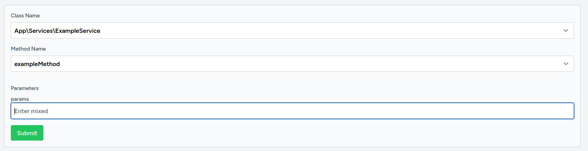
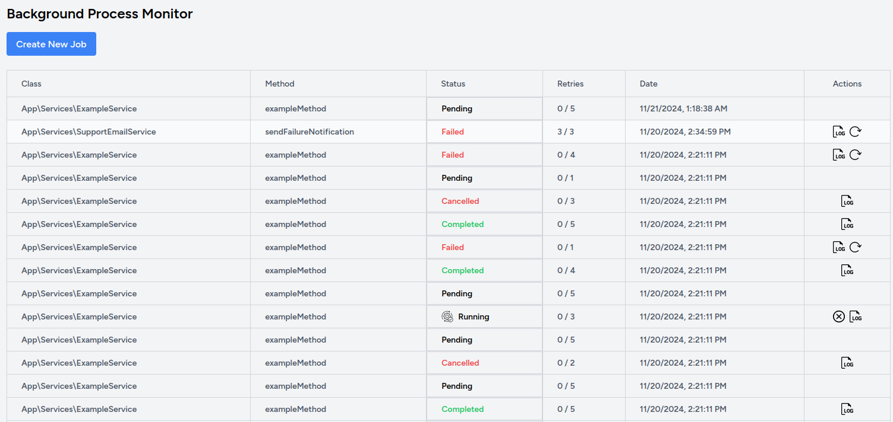
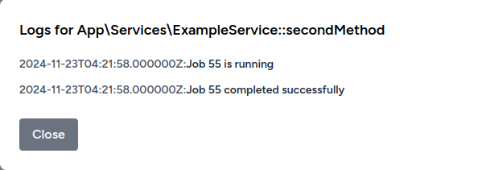

# Laravel / Vue Background Job Manager

This application allows managing and monitoring background jobs through a clean and intuitive dashboard. It provides features to create jobs, retry failed ones, view logs, and analyze job states.

## Prerequisites

Before starting, ensure you have the following installed:

- PHP 8.3+
- Composer
- 
- Laravel Sail (optional, for Docker-based development)
- A database (MySQL recommended)

---

## Getting Started

### Step 1: Clone the Repository

Clone this repository to your local machine:

```bash
git clone <repository-url>
cd <repository-folder>
```

### Step 2: Install Dependencies

Install all necessary dependencies using Composer:

```bash
composer install
```

### Step 3: Setup Environment File

Copy the `.env.example` file to `.env`:

```bash
cp .env.example .env
```

#### Update the following variables in the `.env` file:

1. Set the **application company name**:
   ```env
   APP_COMPANY_NAME=YourCompanyName
   ```
2. Configure your database connection:
   ```env
   DB_CONNECTION=mysql
   DB_HOST=127.0.0.1
   DB_PORT=3306
   DB_DATABASE=your_database_name
   DB_USERNAME=your_database_username
   DB_PASSWORD=your_database_password
   ```

### Step 4: Generate Application Key

Generate a new application key:

```bash
php artisan key:generate
```

### Step 5: Run Migrations and Seeders

Run the database migrations and seeders to set up the initial database structure and create an admin user:

```bash
php artisan migrate --seed
```

### Step 6: Install Node.js Dependencies

```bash
npm install
```


---

## Running the Application

### Run node.js

To start the development server for the frontend, run:

```bash
npm run dev
```

### Option 1: Without Docker

To serve the application locally, run:

```bash
php artisan serve
```

### Option 2: Using Laravel Sail (Docker)

Start the application using Laravel Sail for a containerized setup:

```bash
./vendor/bin/sail up -d
```

Once the application is running, visit `http://localhost` in your browser.

---

## Admin Login

After running the seeders, an admin user will be created with the following credentials:

- Email: `admin@example.com`
- Password: `password`

You can log in with these credentials to access the application.

---

## Features

### 1. Create Background Jobs

Users can create background jobs by selecting available classes and methods from the configuration file. The system also analyzes and displays the parameters for the selected method.



### 2. View Dashboard

The dashboard provides a summary of all jobs, their states, retries, and priorities.



### 3. View Logs

Logs for each job can be accessed to analyze execution details.



### 4. Retry Failed Jobs

Failed jobs can be retried with a single click. The retry attempts and delays are configurable in the `background_jobs.php` file.

---

## Configuration Options

The `background_jobs.php` configuration file allows customizing retries, delays, and priority for each class. For example:

```php
'allowed_classes' => [
    App\Services\ExampleService::class => [
        'retries' => 5,
        'delay' => 60, // in seconds
        'priority' => 3,
    ],
    App\Services\SupportEmailService::class => [
        'retries' => 3,
        'delay' => 120, // in seconds
        'priority' => 2,
    ],
],
'default_retries' => 0,
'default_delay' => 0,
'default_priority' => 3,
```

---

## Security Settings

### Validating Classes and Methods

The application uses the `BackgroundJobValidator` service to ensure only authorized classes and methods can be executed. Add or remove classes and methods from the `background_jobs.php` configuration file as required.

---

## Additional Notes

- Ensure your database connection is active before running migrations.
- Always check that the `APP_COMPANY_NAME` is set in the `.env` file for branding consistency.
- Use the admin credentials provided in the seeder to explore all features.

---

## Contributing

Feel free to open issues or submit pull requests to improve the application. Any contributions are welcome!

---

## License

This project is open-source and licensed under the [MIT license](LICENSE).
